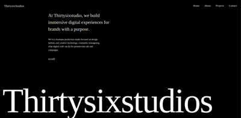

# ThirtySixStudios Animated Website Clone



This repository is a React-based animated website clone inspired by **ThirtySixStudios**. It features a unique bell-paper rolling effect triggered when clicking the big H1 text "ThirtySixStudios" on Section 2 of the page. The animations are powered by **GSAP** (GreenSock Animation Platform), and the project was created with inspiration and guidance from a YouTube tutorial.

## 🚀 Features

- **Interactive Bell-Paper Rolling Effect**: Activated by clicking the "ThirtySixStudios" H1 text on Section 2.
- **Smooth Animations**: Designed with GSAP to ensure fluid and professional-grade motion effects.
- **Modern Tech Stack**: Built using React, GSAP, and styled for an optimal user experience.


## 🛠️ Tech Stack

- **Frontend Framework**: React
- **Animation Library**: GSAP
- **Styling**: CSS/Tailwind CSS (optional, based on your choice)

## 📂 Project Structure

```plaintext
src/
├── components/
│   ├── Canvas.jsx
│   ├── animatingimages.js  
// Contains the bell-paper rolling effect and on click logic
│   ├── Canvas.jsx
│   └── app.jsx
├── styles/
│   ├──index.css
│   
├── App.jsx
└── main.jsx
```
🖥️ Getting Started
Follow the steps below to run the project locally.

Prerequisites
Node.js installed on your machine
npm or yarn package manager

Installation
Clone the repository:
```bash
git clone [https://github.com/yourusername/thirtysixstudios-clone.git](https://github.com/yourusername/thirtysixstudios-clone.git)
Navigate to the project directory:
```

```bash

cd thirtysixstudios-clone

```
```bash
Install dependencies:

npm install
```

```Bash
Start the development server:
npm start

```
The website should now be running at http://localhost:3000.

# 📜 How It Works
- ### The H1 text "ThirtySixStudios" on Section 2 has an onClick event listener.
- ### When clicked, a GSAP animation is triggered to create a bell-paper rolling effect, visually engaging the user.
- ### The website leverages Locomotive Scroll v5 for smooth scrolling and enhanced visual interactions.
# 📚 Resources and Inspiration
- ### This project was built with the help of the following resources:
- ### YouTube Tutorial: [https://www.youtube.com/watch?v=5WDNHl-x-AM&t=63s]
- ### GSAP Documentation: https://greensock.com/docs/
- ### Locomotive Scroll v5 Documentation: https://github.com/locomotivemtl/locomotive-scroll
# 🐛 Known Issues
- ### Performance might vary based on the device and browser due to the complexity of animations.
- ### Further optimization might be needed for mobile devices.

# 🤝 Contributing
- ### Contributions are welcome! If you have suggestions or improvements, feel free to open an issue or submit a pull request.


# 📧 Contact
- ### For any questions or feedback, feel free to reach out at -: hbhoir002@gmail.com.


# 📄 License
This project is licensed under the MIT License.


### ⭐️ Don't forget to give this repo a star if you found it helpful!